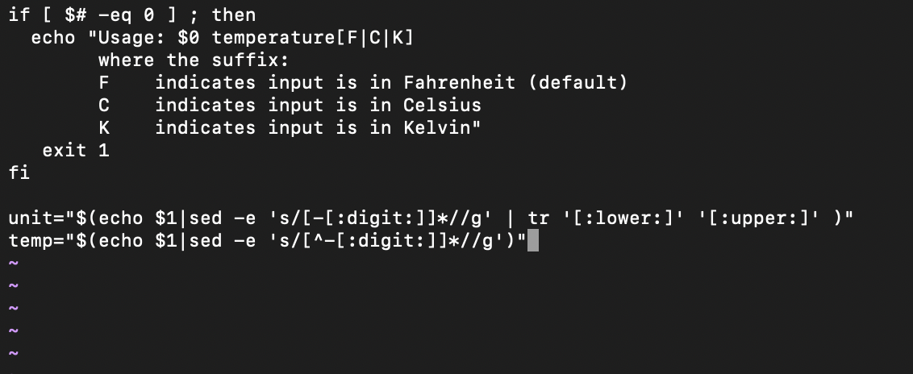

# Exam_2420
Part 1 \
sudo apt upgrade is used to update most of the software on your Ubuntu OS \

NOTE: You can check what to update by using sudo apt update

Part 2 
1. Create a directory in VM using mkdir final \
2. Create a file in the directory using touch part2 \
3. Open vim editor to edit vim part2
4. Paste the code in it \
5. Pressing "I" and edit the text file just like normal word documents

Part 3 \
journalctl \
1. To print logs for the current boot use command journalctl

Part 4 \
1. Add a user by using the command: useradd -ms /bin/bash USER_NAME \
2. Add the user to the sudo group by using the command: usermod -aG sudo USER_NAME \
3. Modify ownership by using the command:rsync --archive --chown=USER_NAME:USER_NAME ~/.ssh /home/USER_NAME \
4. Create a bash script using touch part4.sh
5. Write a bash script 
6. Give the script permission to excute by using chmod +x part4.sh
